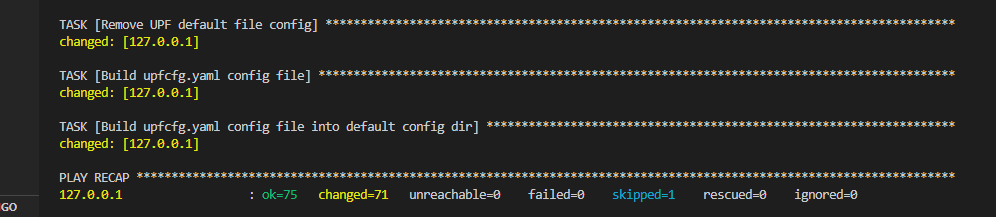
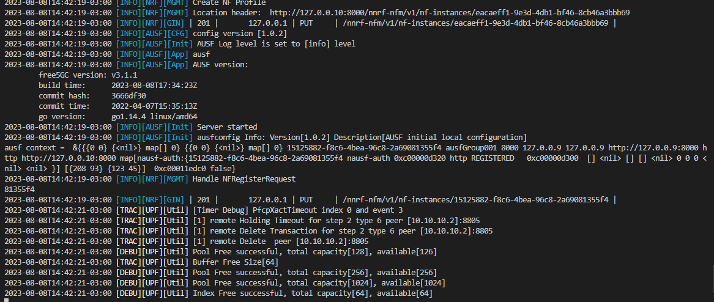
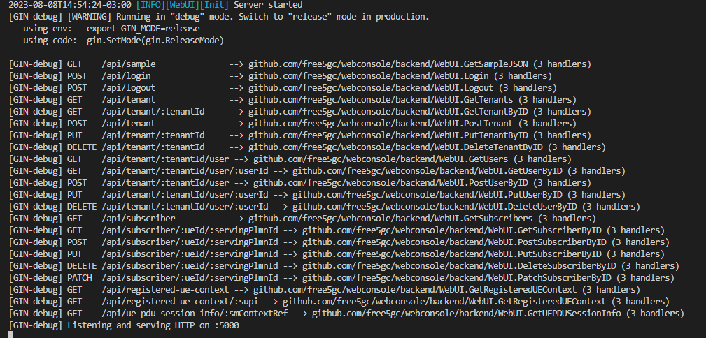

# SAMURAI-IoT-Access
This repository describes steps for installing the elements that make up SAMURAI-IoT-Access (UE-non3GPP + N3IWF + Free5gc). The installation process involves 3 different machines 1st responsible for running 5GC, 2nd responsible for running N3IWF and 3rd responsible for running UE-non3GPP. The main objective is to provide communication with IoT devices and the 5G core.

#### 5GC environment
* SO: Ubuntu 20.04 (LTS) x64
* Uname -r: >= 5.4.0-122-generic
* Memory: 4 GB
* Disk: 80 GB

#### N3IWF environment
* SO: Ubuntu 20.04 (LTS) x64
* Memory: 2 GB
* Disk: 20 GB

#### UE-non3GPP environment
* SO: Ubuntu 20.04 (LTS) x64
* Memory: 2 GB
* Disk: 20 GB

## SAMURAI-IoT-Access components installation

Before starting the installation, it is necessary to edit the ```5gc-install.yml```, ```n3iwf-install.yml``` and ```ue-non3gpp-install.yml``` files, informing the respective IP addresses where each of the artifacts will be deployed in the variable declaration structure.

The installation steps for each of the 3 components are described below. 
**Attention: All installation steps described below must be performed with root privileges (SUDO SU).**


#### 1º 5GC (Free5gc)
Access via terminal the machine where the 5GC will be executed. 
Install python + git + ansible:
```
sudo apt update && apt -y install python && sudo apt -y install git && sudo apt -y install ansible
```

Clone this repository:
```
git clone https://github.com/LABORA-INF-UFG/SAMURAI-IoT-Access.git
```

Install GOLang 1.14.4:
```
cd SAMURAI-IoT-Access &&  ansible-playbook -K golang-install.yml
source ~/.bashrc
```

Run ```ifconfig``` and get the name of **internet network interface**, that provides to the host with access to the internet, like as illustrated in the figure below:
<p align="center">
     
</p>

This interface that will be used by the UPF to provide internet access to the UE's registered in the 5GC.

Edit the ```5gc-install.yml``` and replace the ```<<IP-address-visible-to-n3iwf>>``` marker with the IP address of the machine where the core is being deployed, and which must be visible to n3iwf.

Run the following Ansible playbook (password for sudo is required):
```
cd SAMURAI-IoT-Access && ansible-playbook -K 5gc-install.yml -e  "internet_network_interface=<< internet network interface name>>"
```

Wait a few seconds for Ansible to finish configuring the 5GC. The result of the execution should look something like the one shown in the figure below.
<p align="center">
     
</p>

#### Initializing the 5GC functions
After installation we must initialize the 5GC. The entire installation was performed following the standard for applications written in GOLang. Go to `` /root/go/src/free5gc `` and run the following command to init 5GC functions ``./run.sh ``. After execution, the expected result is something similar to what is shown in the following figure.
<p align="center">
     
</p>

**Important Note:** In the image above, the __verbosity level__ of the UPF LOG was defined as ``TRACE``. In a standard installation, the __verbosity level__ is probably defined as ``INFO``, so the output will probably not be identical to the image above, which does not mean an 5GC initialization failure. Pay attention to any messages labeled as ``ERROR`` in the log output, they will be printed in red color and then they will indicate some failure in the installation process.

#### Initializing the 5GC API Server
After initializing the microservices that control the data and control planes, it is also necessary to initialize the API that controls access to the 5GC database in MongoDB. This service will be used later for the registration of UEs in the 5GC.  Open another terminal and access the  `` /root/go/src/free5gc/webconsole `` directory. Then type the following command  `` go run server.go ``. . After execution, the expected result is something similar to what is shown in the following figure.
<p align="center">
     
</p>

#### 2º N3IWF (Free5gc)
Access via terminal the machine where the N3IWF will be executed. 
Install python + git + ansible:
```
sudo apt update && apt -y install python && sudo apt -y install git && sudo apt -y install ansible
```

Clone this repository:
```
git clone git clone https://github.com/LABORA-INF-UFG/SAMURAI-IoT-Access.git
```

Install GOLang 1.14.4:
```
cd SAMURAI-IoT-Access &&  ansible-playbook -K golang-install.yml
source ~/.bashrc
```

Edit the ```n3iwf-install.yml``` and replace the following markers with their respective IP addresses:
* ```<<IP-address-for-IKE-communication-visible-to-UEnon3GPP>>```: This parameter must be replaced by the IP address of the machine where the N3IWF was installed, it must be visible to UEnon3GPP and will be used for communication and subsequent establishment of communication tunnels for the data and control planes. 
* ```<<5G-core-ip-address-for-connection-to-AMF>>```: This parameter must be replaced by the IP address of the machine where free5GC was installed. It will be used to establish communication between N3IWF and the AMF for subsequent validation of UE-non3GPP access credentials and construction of communication tunnels for the data and control planes. 

Run the following Ansible playbook to install N3IWF (password for sudo is required):
```
cd SAMURAI-IoT-Access && ansible-playbook -K n3iwf-install.yml
```